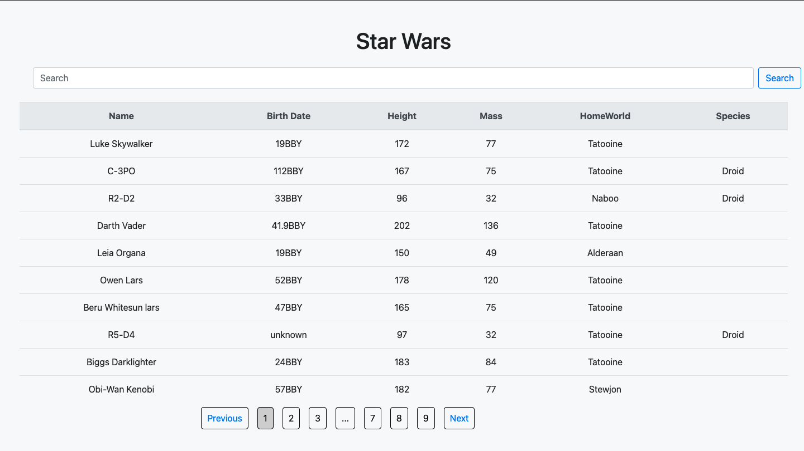

## Star Wars API

A Star Wars database written in Javascript, HTML and CSS - uses React with Bootrap 

Try it [here](https://gh-expense-tracker.herokuapp.com)

#### Summary

Continuing my focus on React, this project builds upon the last by adding HTTP requests.  I enjoyed learning and exploring REST API's, Promises
in Javascript and the Axios library.  It was quite a struggle pulling data from multidemensial arrays, as it made for some challenging algorithms. Overall
i am thrilled with the results and with the degree of complexity my projects are getting to.

#### Author

Greg Hilger - Full-Stack Software Developer 
